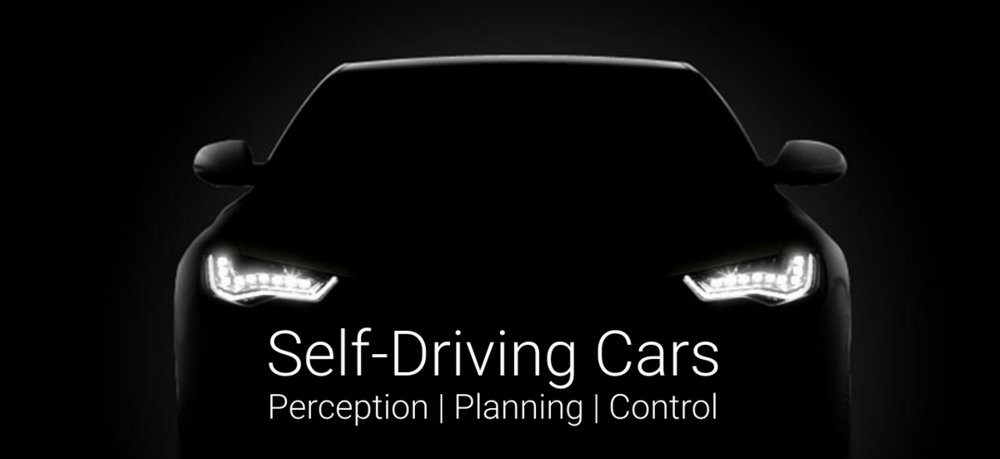

# Self-Driving_Cars_Notebook

It's a notebook of Self-Driving Cars which is instructed by Prof. Dr.-Ing. Andreas Geiger in 2021.

Class link: [youtube](https://www.youtube.com/playlist?list=PL05umP7R6ij321zzKXK6XCQXAaaYjQbzr).

[Course Website](https://uni-tuebingen.de/fakultaeten/mathematisch-naturwissenschaftliche-fakultaet/fachbereiche/informatik/lehrstuehle/autonomous-vision/lectures/self-driving-cars/) with Slides, Lecture Notes, Problems and Solutions.

## Contents

[L1 Introduction](#l1-introduction)

[1.1 Organization](#11-organization)

[1.2 Introduction](#12-introduction)

[1.3 History of Self-Driving](#13-history-of-self-driving)

[L2 Imitation Learning](#l2-lmitation-learning)

[2.1 Approaches to Self-Driving](#21-approaches-to-self-driving)

[2.2 Deep Learning Recap](#22-deep-learning-recap)

[2.3 Imitation Learning](#23-limitation-leaning)

[2.4 Conditional Imitation Learning](#24-conditional-limitation-learning)

[L3 Direct Perception](#l3-direct-perception)

[3.1 Direct Perception](#31-direct-perception)

[3.2 Conditional Affordance Learning](#32-conditional-affordance-leaning)

[3.3 Visual Abstractions](#33-visual-abstractions)

[3.4 Driving Policy Transfer](#34-dirving-policy-transfer)

[3.5 Online vs. Offline Evaluation](#35-online-vs-offline-evaluation)

[L4 Reinforcement Learning](#l4-reinforcement-learning)

[4.1 Markov Decision Processes](#41-markov-decision-processes)

[4.2 Bellman Optimality and Q-Learning](#42-bellman-optimality-and-q-learning)

[4.3 Deep Q-Learning](#43-deep-q-leaning)

[L5 Vehicle Dynamics](#l5-vehicle-dynamics)

[5.1 Introduction](#51-introduction)

[5.2 Kinematic Bicycle Model](#52-kinematic-bicyle-model)

[5.3 Tire Models](#53-tire-models)

[5.4 Dynamic Bicycle Model](#54-dynamic-bicyle-model)

[L6 Vehicle Control](#l6-vehicle-control)

[6.1 Introduction](#61-introduction)

[6.2 Black Box Control](#62-black-box-control)

[6.3 Geometric Control](#63-geometry-control)

[6.4 Optimal Control](#64-optimal-control)

[L7 Odometry, SLAM and Localization](#l7-odometry-slam-and-localization)

[7.1 Visual Odometry](#71-visual-odometry)

[7.2 Simultaneous Localization and Mapping](#72-simultaneous-localization-and-mapping)

[7.3 Localization ](#73-localization)

[L8 Road and Lane Detection](#l8-road-and-lane-detection)

[8.1 Introduction](#81-introduction)

[8.2 Road Segmentation](#82-road-segmenation)

[8.3 Lane Marking Detection](#83-lane-marking-detection)

[8.4 Lane Detection](#84-lane-detection)

[8.5 Lane Tracking](#85-lane-tracking)

[L9 Reconstruction and Motion](#l9-reconstruction-and-motion)

[9.1 Stereo Matching](#91-stereo-matching)

[9.2 Freespace and Stixels](#92-freespace-and-stixels)

[9.3 Optical Flow](#93-optical-flow)

[9.4 Scene Flow](#94-scene-flow)

[L10 Object Detection](#l10-object-detection)

[10.1 Introduction](#101-introduction)

[10.2 Performance Evaluation](#102-performance-evaluation)

[10.3 Sliding Window Object Detection](#103-sliding-window-object-detection)

[10.4 Region Based CNNs](#104-region-based-cnns)

[10.5 3D Object Detection](#105-3d-object-detection)

[L11 Object Tracking](#l11-object-tracking)

[11.1 Introduction](#111-introduction)

[11.2 Filtering](#112-filtering)

[11.3 Association](#113-association)

[11.4 Holistic Scene Understanding](#114-holistic-scene-understanding)

[L12 Decision Making and Planning](#l12-decision-making-and-planning)

[12.1 Introduction](#121-introduction)

[12.2 Route Planning](#122-route-planning)

[12.3 Behavior Planning](#123-behavior-panning)

[12.4 Motion Planning](#124-motion-planning)

## L1 Introduction

### 1.1 Organization

### 1.2 Introduction

### 1.3 History of Self-Driving

## L2 Imitation Learning

### 2.1 Approaches to Self-Driving

### 2.2 Deep Learning Recap

### 2.3 Imitation Learning

### 2.4 Conditional Imitation Learning

## L3 Direct Perception

### 3.1 Direct Perception

### 3.2 Conditional Affordance Learning

### 3.3 Visual Abstractions

### 3.4 Driving Policy Transfer

### 3.5 Online vs. Offline Evaluation

## L4 Reinforcement Learning

### 4.1 Markov Decision Processes

### 4.2 Bellman Optimality and Q-Learning

### 4.3 Deep Q-Learning

## L5 Vehicle Dynamics

### 5.1 Introduction

### 5.2 Kinematic Bicycle Model

### 5.3 Tire Models

### 5.4 Dynamic Bicycle Model

## L6 Vehicle Control

### 6.1 Introduction

### 6.2 Black Box Control

### 6.3 Geometric Control

### 6.4 Optimal Control

## L7 Odometry, SLAM and Localization

### 7.1 Visual Odometry

### 7.2 Simultaneous Localization and Mapping

### 7.3 Localization 

## L8 Road and Lane Detection

### 8.1 Introduction

### 8.2 Road Segmentation

### 8.3 Lane Marking Detection

### 8.4 Lane Detection

### 8.5 Lane Tracking

## L9 Reconstruction and Motion

### 9.1 Stereo Matching

### 9.2 Freespace and Stixels

### 9.3 Optical Flow

### 9.4 Scene Flow

## L10 Object Detection

### 10.1 Introduction

### 10.2 Performance Evaluation

### 10.3 Sliding Window Object Detection

### 10.4 Region Based CNNs

### 10.5 3D Object Detection

## L11 Object Tracking

### 11.1 Introduction

### 11.2 Filtering

### 11.3 Association

### 11.4 Holistic Scene Understanding

## L12 Decision Making and Planning

### 12.1 Introduction

### 12.2 Route Planning

### 12.3 Behavior Planning

### 12.4 Motion Planning